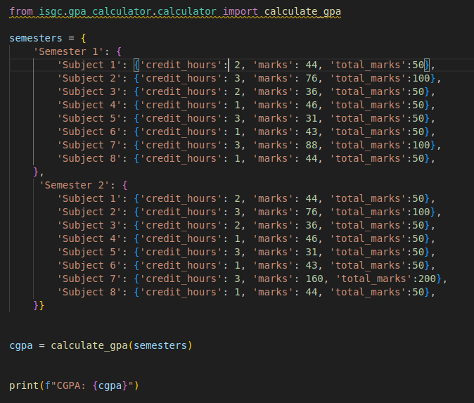

# Islamia University Bahawalpur SGPA, CGPA Calculation And Analysis

1. How to Run the project.

`pip install isgc`

2. import calculation_gpa

`from isgc.gpa_calculator.calculator import calculate_gpa`

3. Enter Semesters detail like that.

    <pre>
        <code id="semesters" class="json">
{
    "Semester 1": {
        "Subject 1": {"credit_hours": 2, "marks": 44, "total_marks": 50},
        "Subject 2": {"credit_hours": 3, "marks": 76, "total_marks": 100},
        "Subject 3": {"credit_hours": 2, "marks": 36, "total_marks": 50},
        "Subject 4": {"credit_hours": 1, "marks": 46, "total_marks": 50},
        "Subject 5": {"credit_hours": 3, "marks": 31, "total_marks": 50},
        "Subject 6": {"credit_hours": 1, "marks": 43, "total_marks": 50},
        "Subject 7": {"credit_hours": 3, "marks": 88, "total_marks": 100},
        "Subject 8": {"credit_hours": 1, "marks": 44, "total_marks": 50}
    },
    "Semester 2": {
        "Subject 1": {"credit_hours": 2, "marks": 44, "total_marks": 50},
        "Subject 2": {"credit_hours": 3, "marks": 76, "total_marks": 100},
        "Subject 3": {"credit_hours": 2, "marks": 36, "total_marks": 50},
        "Subject 4": {"credit_hours": 1, "marks": 46, "total_marks": 50},
        "Subject 5": {"credit_hours": 3, "marks": 31, "total_marks": 50},
        "Subject 6": {"credit_hours": 1, "marks": 43, "total_marks": 50},
        "Subject 7": {"credit_hours": 3, "marks": 160, "total_marks": 200},
        "Subject 8": {"credit_hours": 1, "marks": 44, "total_marks": 50}
    }
}
        </code>
    </pre>

4. Make an Object.

`cgpa=calculation_gpa(semesters)`

5. print output.

`print(cgpa)`

